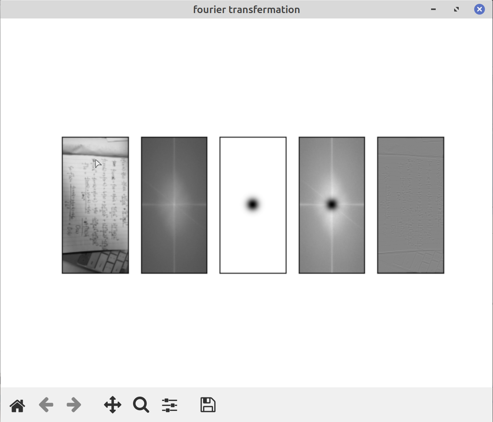
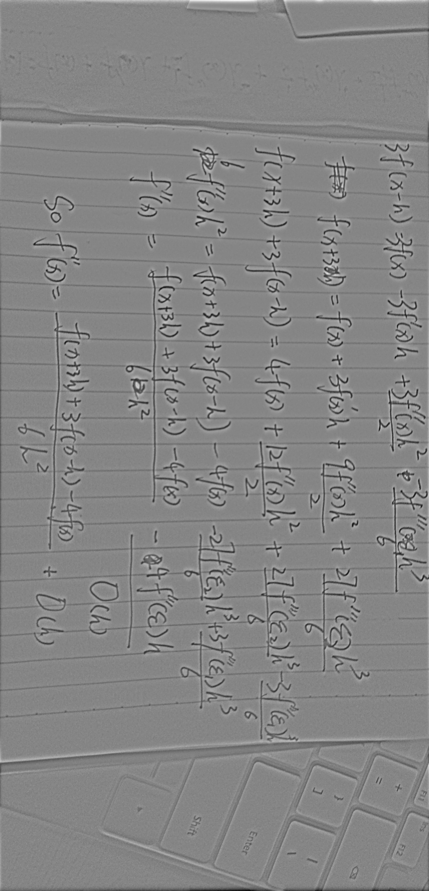

# Filter image base on Fourier transfer

The filter application written by Erwin for course Numerical Computation(1001).
2020-12

## help

```
$ python3 filter.py -h
usage: filter.py [-h] [-i input file] [-o output file] [-hol high or low]
                 [-D D] [-n N]
                 filter

a simple image processer base on fourier transfer

positional arguments:
  filter            the filter you want to use, candidate:[butterworth,gauss]

optional arguments:
  -h, --help        show this help message and exit
  -i input file     the path of input file
  -o output file    the path of output file
  -hol high or low  high pass filter or low pass filter
  -D D              D0 parameter
  -n N              n parameter

```

## Thheory

1. Butterworth filter:

    low pass filter: 

    high pass filter: 

2. Gauss filter:

    low pass filter: 

    high pass filter: 

## Example

```shell
python3 filter.py gauss -i example.jpg -o example_out.jpg -D 40 -hol high
```

There will have a window pop out, which display the process of filter:


After there will have a image named “example_out.jpg” in the folder, which is the result we want:


